# CloudSec AI

**An AWS-native, serverless incident-response platform with evidence-bounded AI investigation and policy-controlled remediation.**

CloudSec AI ingests security telemetry, correlates findings into incidents, assembles evidence, requests a structured Amazon Bedrock recommendation, applies deterministic safety checks, obtains human approval when required, executes allow-listed playbooks, independently verifies the result, and preserves an auditable report.

> [!WARNING]
> This is an educational portfolio project. Automated remediation changes AWS resources. Use only a dedicated lab account or an isolated `cloudsec-lab-*` namespace, review every Terraform plan, and complete a production security review before real-world use. Bedrock is advisory and has no permission to execute AWS actions.

## Architecture


The design separates workload telemetry, the security control plane, and disposable lab resources. A custom EventBridge bus coordinates loosely coupled Lambda services. DynamoDB stores findings and incident state; S3 and KMS preserve evidence; Step Functions controls remediation and approval waits; CloudWatch, SNS, and SQS provide observability and failure handling.

Read the [architecture explanation](docs/architecture.md), [architecture decisions](docs/architecture-decisions.md), [threat model](docs/threat-model.md), and [IAM design](docs/iam-design.md).

## Safety model

```text
Telemetry -> Correlation -> Evidence -> AI recommendation
                                      -> Schema + evidence + policy validation
                                      -> Risk level
                                         Level 1: allow-listed automation
                                         Level 2: authenticated human approval
                                         Level 3: reject and escalate
                                      -> Step Functions remediation
                                      -> Independent verification
                                      -> Resolve or escalate
```

The model cannot call remediation APIs. Every proposed action must pass schema validation, evidence matching, an approved-action policy, risk classification, and—in elevated-risk cases—an authenticated approval decision. Unknown actions, false policy results, and evidence mismatches are rejected without a state-changing AWS call.

## Verified lab result

The isolated live-lab run demonstrated the complete control loop:

| Scenario | Expected control | Verified outcome |
|---|---|---|
| Public S3 exposure | Contain and verify | Public access blocked; incident resolved |
| Compromised IAM key—approved | Wait for authenticated decision | Key disabled; workflow succeeded; incident resolved |
| Compromised IAM key—rejected | Preserve state and escalate | Key remained active; incident escalated |
| Unknown action | Reject before execution | Schema rejection; zero state-changing calls |
| Evidence mismatch | Reject before execution | Evidence rejection; zero state-changing calls |
| Policy denied | Reject before execution | Policy rejection; zero state-changing calls |

The automated suite completed with **171 passed**, and total measured coverage reached **74.95%**. Terraform also reported that the deployed lab infrastructure matched its configuration with no changes required.

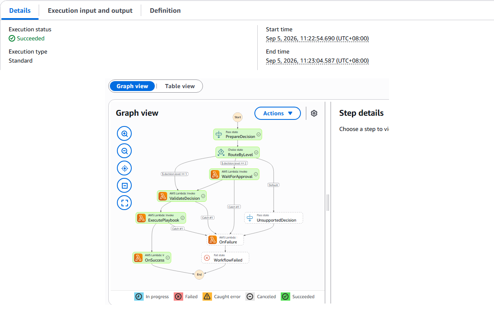

## Platform capabilities

- GuardDuty, Security Hub, CloudTrail, AWS Config, and VPC-flow-log ingestion
- Normalized findings and deterministic incident correlation
- Evidence packaging, attack-timeline reconstruction, MITRE ATT&CK mapping, and blast-radius analysis
- Structured, evidence-bounded Bedrock investigation recommendations
- Explicit safety levels and authenticated API Gateway/Cognito approval flow
- Allow-listed S3, IAM, EC2, and CloudTrail remediation playbooks
- Independent post-remediation verification and terminal-state preservation
- KMS-encrypted data stores, scoped IAM roles, audit logging, dashboards, alerts, and DLQ handling
- Strictly isolated live-lab scenarios and cleanup automation

## Evidence gallery

### Tests and infrastructure reconciliation

| Automated test suite | Terraform drift check |
|---|---|
| 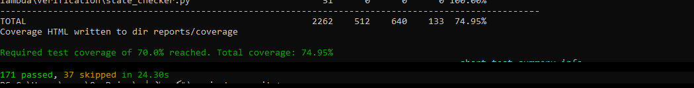 | 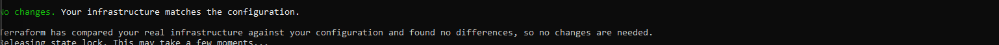 |

### Incident data path

| Normalized findings | Correlated incident |
|---|---|
| 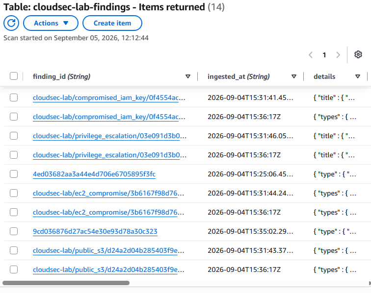 | 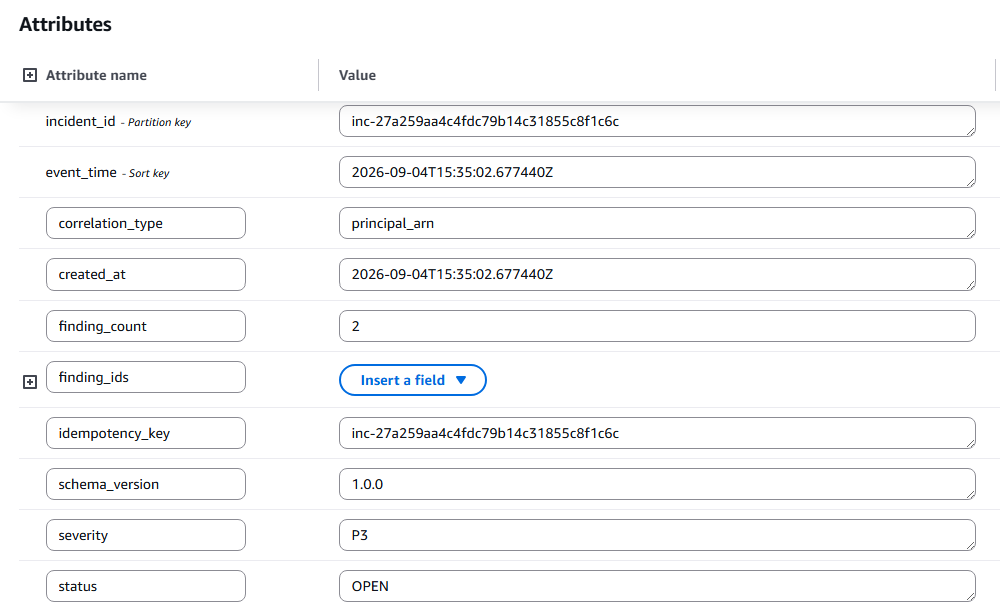 |

### Orchestration and preserved evidence

| Successful workflow | Evidence package |
|---|---|
|  | 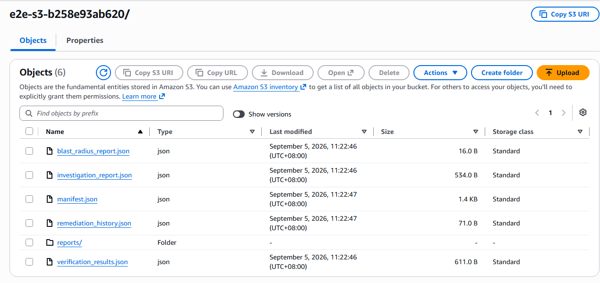 |

### Safety and access control

| Scoped IAM roles | Authenticated approval API |
|---|---|
| 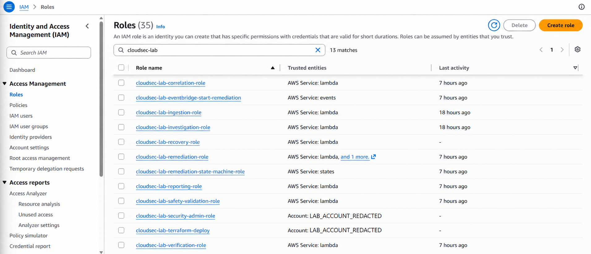 | 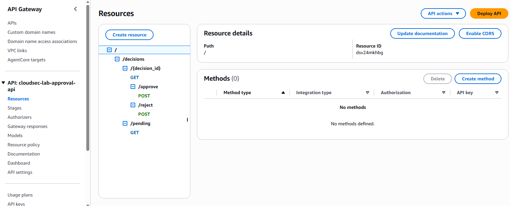 |

### Operations, resilience, and cost

| Platform health | Security outcomes |
|---|---|
| 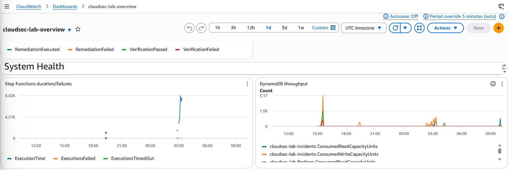 | 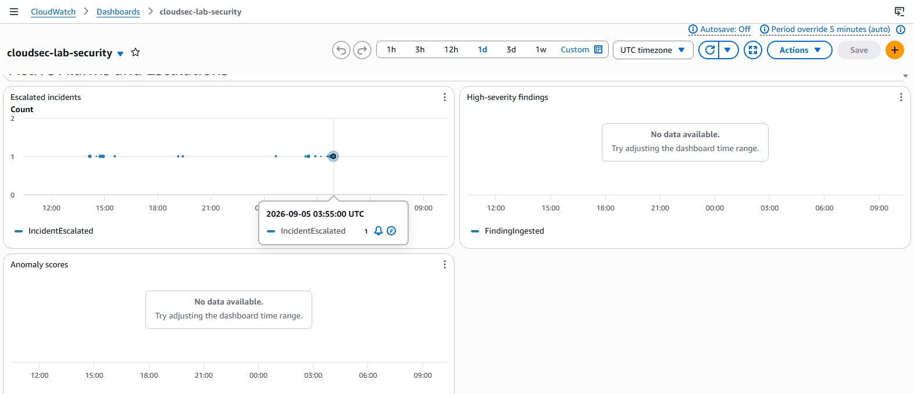 |

| Dead-letter monitoring | Budget guardrails |
|---|---|
| 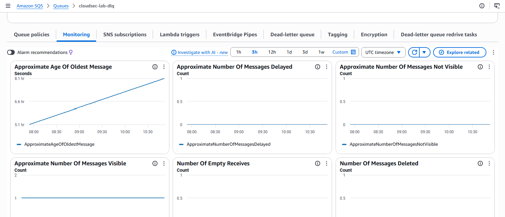 | 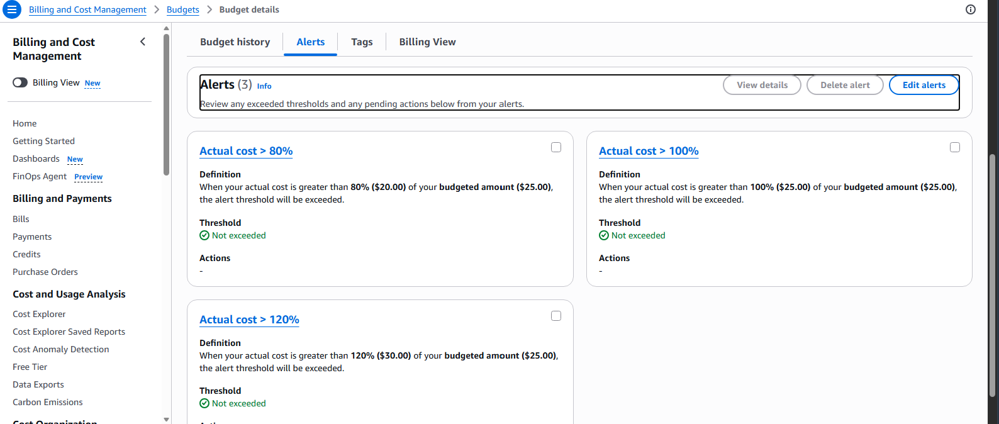 |

See the complete, annotated [evidence gallery](docs/evidence.md). Screenshots are sanitized; account identifiers, resource IDs, endpoints, local paths, and private originals are excluded from version control.

## Technology stack

| AWS service | Role |
|---|---|
| EventBridge | Isolated security event routing and filtering |
| Lambda | Ingestion, correlation, investigation, safety, remediation, verification, and reporting |
| DynamoDB | Findings, incidents, decisions, baselines, audit, idempotency, and knowledge data |
| Bedrock | Structured investigation recommendations only |
| Step Functions | Durable remediation orchestration and human-approval waits |
| API Gateway + Cognito | Authenticated approval and rejection decisions |
| S3 + KMS | Versioned evidence, reports, policies, and encrypted storage |
| CloudWatch + SNS + SQS | Logs, metrics, dashboards, notifications, and dead letters |
| GuardDuty + Security Hub + Config + CloudTrail | Security telemetry and audit sources |

## Repository map

```text
terraform/          infrastructure and environment configuration
lambda/             Python Lambda packages
schemas/            platform event and report schemas
playbooks/          remediation definitions
tests/              unit, integration, Terraform, and opt-in end-to-end tests
attack-simulations/ safe synthetic payloads
lab/                isolated lab fixtures and simulations
scripts/            deployment, verification, demo, and cleanup helpers
docs/               architecture, security, evidence, and operations guides
```

## Safe quick start

1. Use dedicated Security, Workload, and Lab accounts. A strictly isolated `cloudsec-lab-*` namespace may be used for practice only.
2. Install AWS CLI, Terraform, Python 3.11, and Git; authenticate to the intended AWS account.
3. Copy the relevant files from `terraform/environments/<env>/`, replacing every example account and principal value locally.
4. Follow the [deployment guide](docs/deployment.md), save the Terraform plan, and review it before applying.
5. Run the unit suite and environment verification scripts. Run attack simulations only after reading [lab operations](docs/lab-operations.md).

## Documentation

- Operations: [Deployment](docs/deployment.md) · [Cleanup](docs/cleanup.md) · [Troubleshooting](docs/troubleshooting.md) · [Observability](docs/observability.md)
- Security: [AI safety](docs/bedrock-safety-guardrails.md) · [Threat model](docs/threat-model.md) · [Approved actions](docs/approved-action-policy.json)
- Demonstration: [Demo setup](docs/demo-setup.md) · [Demo walkthrough](docs/demo-walkthrough.md) · [Lab operations](docs/lab-operations.md)
- Project context: [Limitations](docs/limitations-and-assumptions.md) · [Costs](docs/cost-documentation.md) · [Interview guide](docs/interview-guide.md)

## License and author

Copyright 2026 Mohammed. Portfolio and educational use. No warranty is provided. Add an approved open-source license before redistributing the project.
