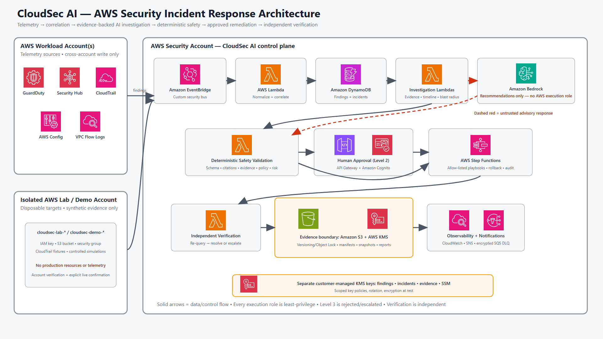

# Architecture

CloudSec AI separates telemetry producers, the security control plane, and destructive test resources into explicit trust boundaries. Workload accounts emit findings and logs to the Security Account; they do not receive access to incident data. The isolated Lab/Demo boundary contains disposable resources and is denied any production target.

The Security Account routes normalized events through a custom EventBridge bus. Lambda stages persist findings and incidents in KMS-encrypted DynamoDB tables, build an evidence package, and ask Bedrock for a structured recommendation. The dashed Bedrock flow is advisory: there is no Bedrock-to-AWS execution path. Schema, citation, evidence, policy, and risk checks precede Step Functions. Level 2 decisions wait for an authenticated human decision. Level 3 decisions are rejected or escalated.

Step Functions invokes only allow-listed remediation handlers through scoped IAM roles. Verification re-queries AWS independently. Evidence, configuration snapshots, remediation history, manifests, and reports are written to the versioned evidence bucket under the evidence KMS boundary. Finding, incident, evidence, and SSM data use separate customer-managed keys.

The canonical editable source is [architecture-diagram.svg](architecture-diagram.svg), built with the official July 2026 AWS Architecture Icon package. A diagrams.net working copy is also available as [architecture-diagram.drawio](architecture-diagram.drawio). See [architecture decisions](architecture-decisions.md), [threat model](threat-model.md), and [IAM design](iam-design.md).
