# Verified Evidence Gallery

This gallery documents the isolated CloudSec AI lab deployment. Public screenshots are deliberately sanitized: AWS account identifiers, resource IDs, live endpoints, local filesystem paths, and private originals are not included.

## Build quality and infrastructure state

| Automated tests | Terraform reconciliation |
|---|---|
|  |  |

## Ingestion and incident correlation

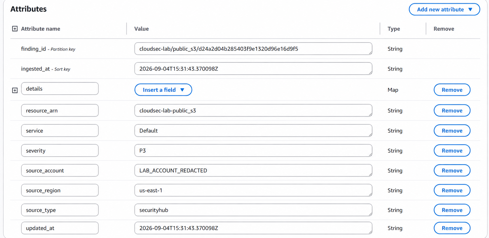

## Event-driven control plane

| Core lifecycle rules | Terminal outcome rules |
|---|---|
| 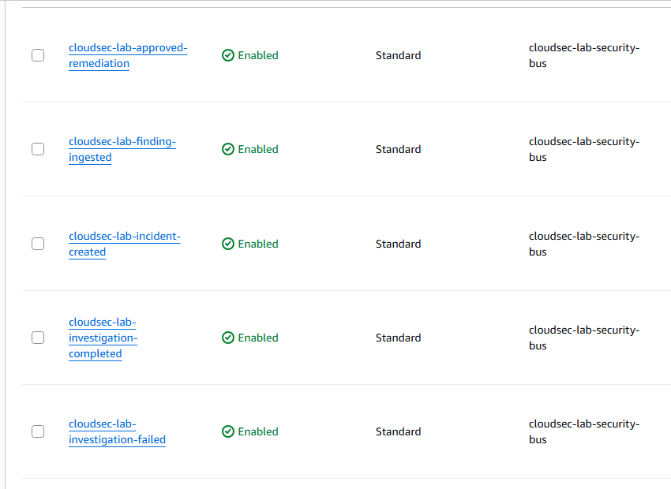 | 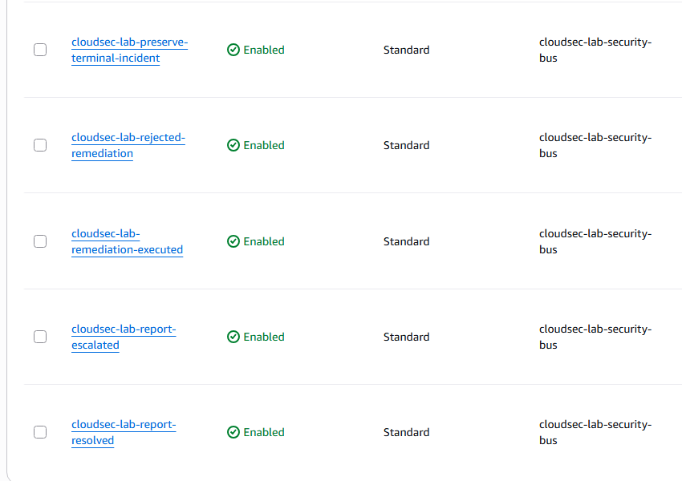 |

| Lambda functions—part 1 | Lambda functions—part 2 |
|---|---|
| 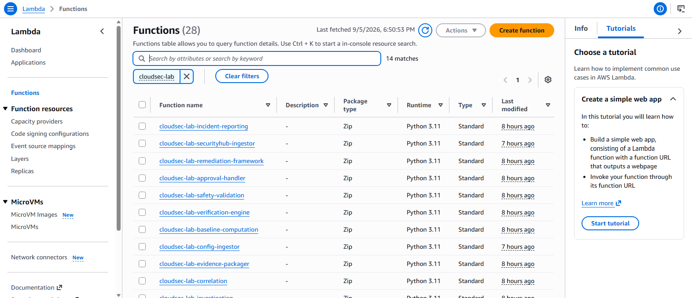 | 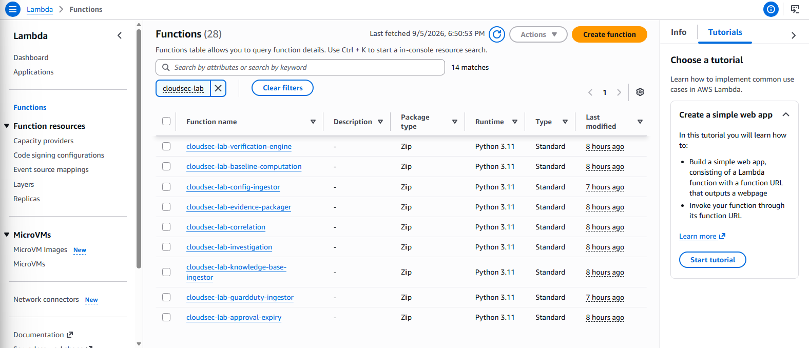 |

## Approval and remediation

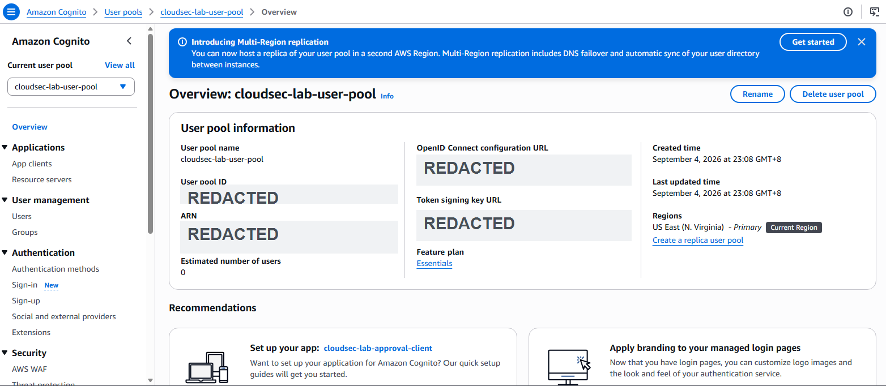

## Evidence preservation

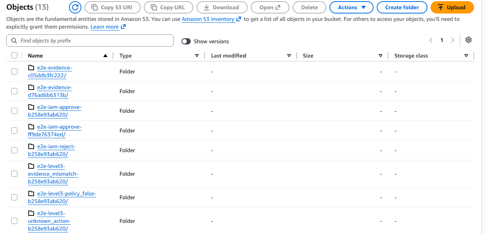

The evidence package contains blast-radius analysis, an investigation report, manifest, remediation history, generated reports, and independent verification results.

## Access control and encryption

| Role policy | Selected least-privilege controls |
|---|---|
| 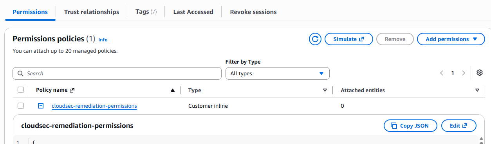 | 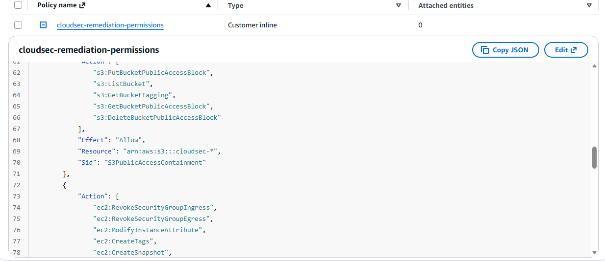 |

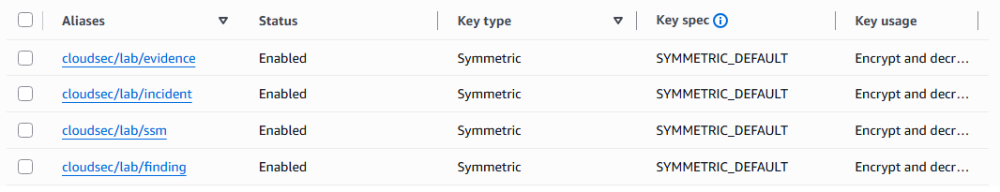

## Observability and resilience

| Remediation outcomes | Platform health |
|---|---|
| 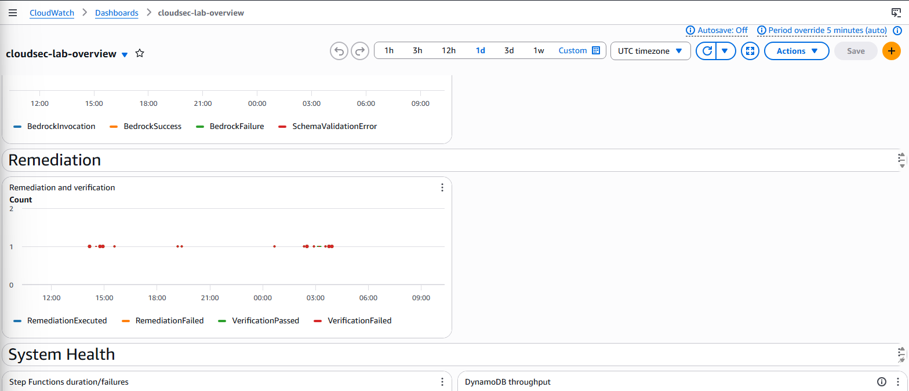 |  |

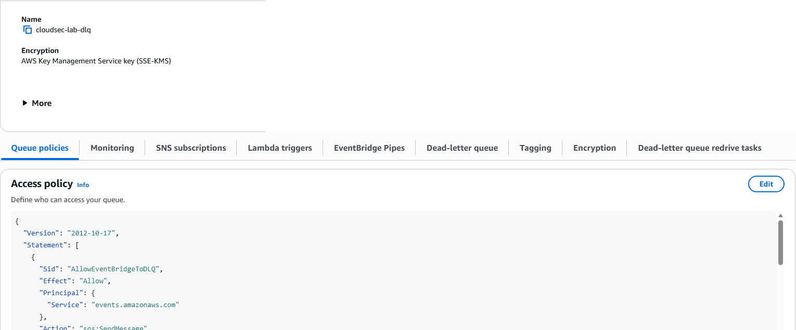

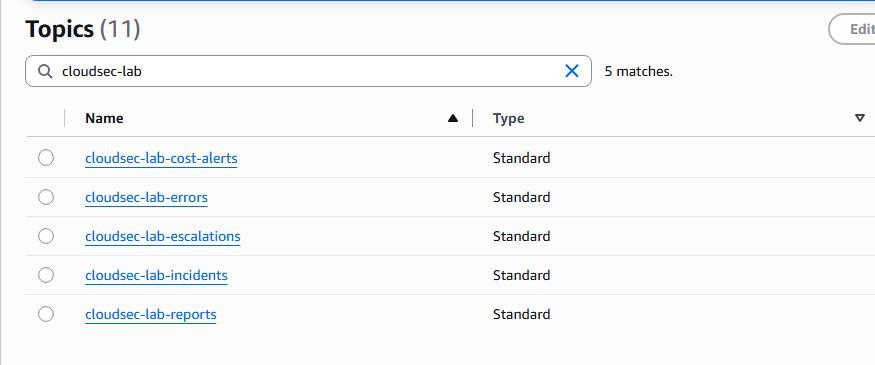

## Audit and governance

| CloudTrail status | Resource governance tags |
|---|---|
| 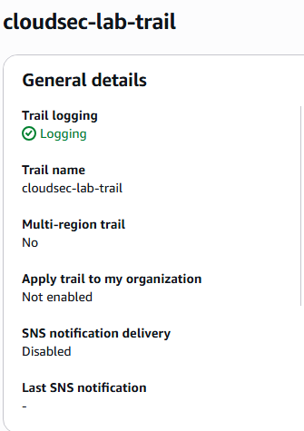 | 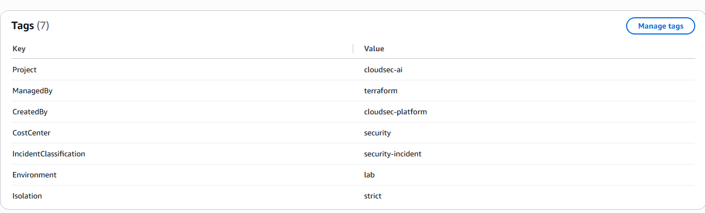 |

## Cost controls

| Current budget health | Alert thresholds |
|---|---|
| 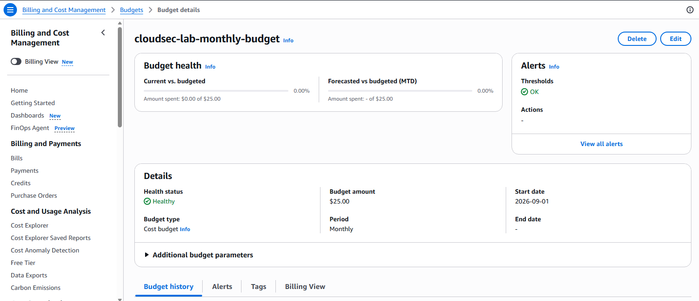 |  |

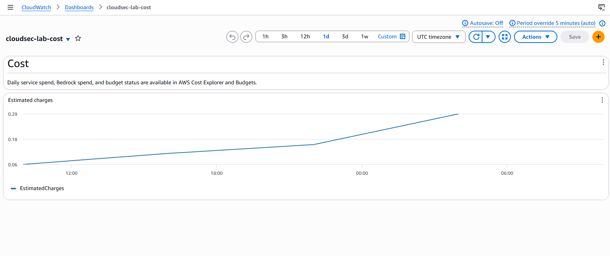

## Interpretation notes

- Empty decision tables after testing are expected because the end-to-end runner removes temporary approval records during cleanup.
- A visible DLQ message is intentional evidence from the malformed-event failure-path checkpoint.
- Some metrics appear only during the short live-test window; zero or empty panels do not imply that the corresponding control is absent.
- The lab is single-region and deliberately isolated. Production deployment requires an additional security, availability, and governance review.
